# Практическая работа 1. Введение, основы работы в командной строке

Все программы запускались в терминале macOS (оболочка zsh, скрипты написаны на bash). Исходные тексты лежат в [src/](src/), тестовые данные — в [demo/](demo/), скриншоты — в [screenshots/](screenshots/).

## Оглавление

[Задача 1](#задача-1) · [2](#задача-2) · [3](#задача-3) · [4](#задача-4) · [5](#задача-5) · [6](#задача-6) · [7](#задача-7) · [8](#задача-8) · [9](#задача-9) · [10](#задача-10)
## Задача 1

**Условие.** Вывести отсортированный в алфавитном порядке список имён пользователей в файле passwd (понадобится grep).

**Решение.** Имя пользователя — первое поле строки в `passwd`, поля разделены двоеточием. Выражение `_\K[^:]+(?=:)` в режиме Perl-регулярных выражений (`-P`) выбирает текст между `_` и ближайшим двоеточием, ключ `-o` выводит только совпадение. На macOS системные пользователи имеют имена вида `_имя`, поэтому подчёркивание отбрасывается. Системный grep в macOS не поддерживает `-P`, поэтому используется GNU-версия `ggrep`. Результат сортируется `sort`.

```bash
ggrep -Po '_\K[^:]+(?=:)' passwd | sort
```

**Запуск:** `cd /etc`, затем команда выше.

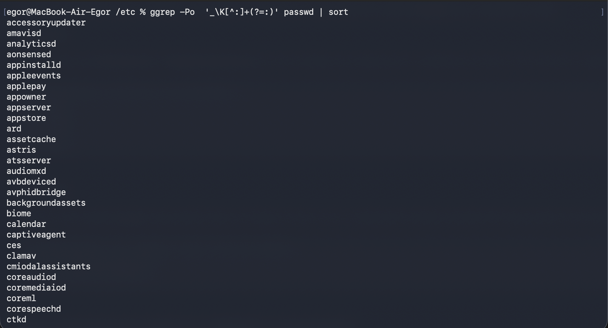

## Задача 2

**Условие.** Вывести данные `/etc/protocols` в отформатированном и отсортированном порядке для 5 наибольших номеров.

**Решение.** Строки-комментарии отбрасываются условием `!/^#/`. Формат файла — `<имя> <номер> <алиасы>`, поэтому `awk` выводит номер, затем имя (`NF>=2` пропускает пустые строки). `sort -k1,1nr` сортирует по первому полю численно по убыванию, `head -5` оставляет пять строк.

```bash
awk '!/^#/ && NF>=2 {print $2, $1}' /etc/protocols | sort -k1,1nr | head -5
```

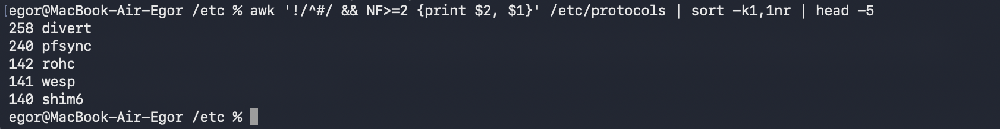

В `/etc/protocols` на macOS есть протоколы 258 (divert) и 240 (pfsync), поэтому первые две строки отличаются от примера в задании; остальные три совпадают.

## Задача 3

**Условие.** Написать программу `banner` средствами bash для вывода текста в рамке; размер баннера должен меняться.

**Решение.** Длина текста берётся встроенным `${#text}`. Ширина рамки — длина текста плюс два пробела по краям. Строка из дефисов: `printf '%*s'` печатает нужное число пробелов, `tr` заменяет их на `-`. Если аргумент не один, выводится подсказка и код возврата 1.

Файл [src/banner](src/banner):

```bash
#!/bin/bash

if [ $# -ne 1 ]; then
    echo "Использование: $0 \"текст\""
    exit 1
fi

text="$1"
len=${#text}
line="+$(printf '%*s' $((len + 2)) '' | tr ' ' '-')+"

echo "$line"
echo "| $text |"
echo "$line"
```

**Запуск:** `chmod +x banner`, затем `./banner 'Hello from RTU MIREA!'`. Текст с `!` в zsh берётся в одинарные кавычки: внутри двойных `!` запускает подстановку из истории.

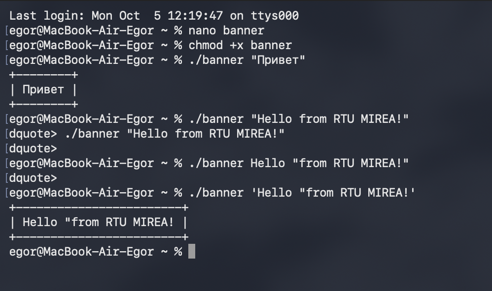


## Задача 4

**Условие.** Написать программу для вывода всех идентификаторов (по правилам C/C++ или Java) в файле, без повторений.

**Решение.** Идентификатор — буква или `_`, далее буквы, цифры, `_`: `[A-Za-z_][A-Za-z_0-9]*`. `grep -oE` выводит каждое совпадение с новой строки, `sort -u` сортирует и убирает повторы, `tr '\n' ' '` склеивает в одну строку.

Файл [src/identifiers](src/identifiers):

```bash
#!/bin/bash

if [ $# -ne 1 ]; then
    echo "Использование: $0 имя_файла"
    exit 1
fi

grep -oE '[A-Za-z_][A-Za-z_0-9]*' "$1" | sort -u | tr '\n' ' '
echo
```

**Запуск:** `./identifiers demo/hello.c`

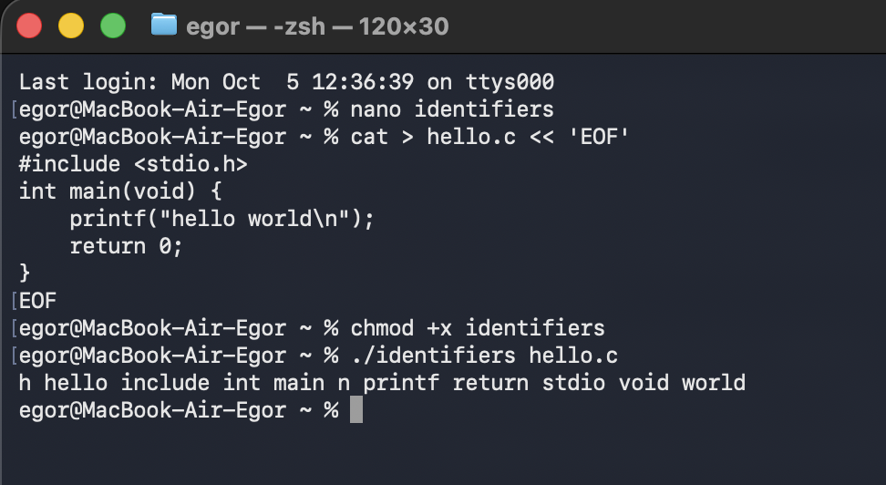

Результат совпадает с примером. Символы `h` и `n` попадают в список, потому что это части `stdio.h` и `\n`.

## Задача 5

**Условие.** Написать программу для регистрации пользовательской команды — правильные права доступа и копирование в `/usr/local/bin`.

**Решение.** `chmod 755` даёт владельцу чтение, запись и выполнение, остальным — чтение и выполнение. Копирование в `/usr/local/bin` требует прав администратора, поэтому `sudo`; `mkdir -p` создаёт каталог, если его нет (на macOS он может отсутствовать). Каталог входит в `PATH`, поэтому команда вызывается без `./`.

Файл [src/reg](src/reg):

```bash
#!/bin/bash

if [ $# -ne 1 ]; then
    echo "Использование: $0 имя_файла"
    exit 1
fi

if [ ! -f "$1" ]; then
    echo "Файл $1 не найден"
    exit 1
fi

chmod 755 "$1"
sudo mkdir -p /usr/local/bin
sudo cp "$1" /usr/local/bin/
echo "Команда $(basename "$1") установлена"
```

**Запуск:** `./reg banner`, затем из другого каталога `banner 'Works'`.

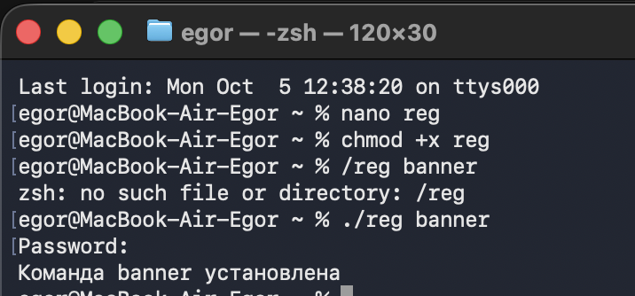

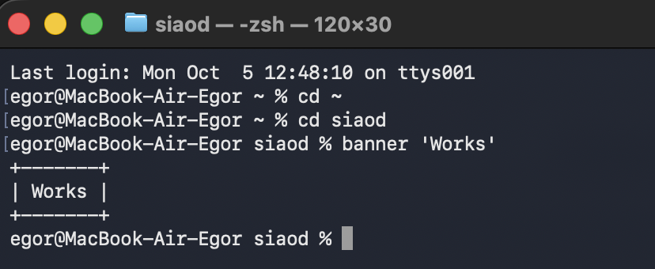

## Задача 6

**Условие.** Написать программу для проверки наличия комментария в первой строке файлов с расширением c, js и py.

**Решение.** `find` собирает файлы, `head -n 1` берёт первую строку. В Python комментарий — `#`, в C и JavaScript — `//` или `/*`. Шаблон выбирается `case` по расширению, `grep -qE` проверяет строку.

Файл [src/checkcomment](src/checkcomment):

```bash
#!/bin/bash

dir="${1:-.}"

find "$dir" -type f \( -name '*.c' -o -name '*.js' -o -name '*.py' \) | while IFS= read -r file; do
    first=$(head -n 1 "$file")
    case "$file" in
        *.c|*.js) pattern='^[[:space:]]*(//|/\*)' ;;
        *.py)     pattern='^[[:space:]]*#' ;;
    esac
    if echo "$first" | grep -qE "$pattern"; then
        echo "ЕСТЬ комментарий: $file"
    else
        echo "НЕТ комментария:  $file"
    fi
done
```

**Запуск:** `./checkcomment test6`

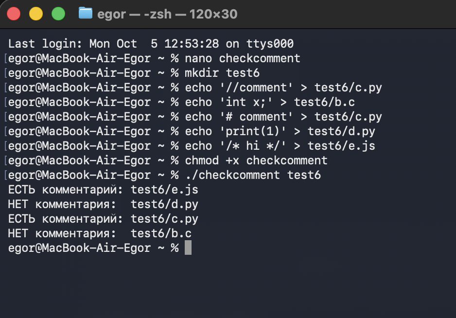

Файлы `e.js` и `c.py` начинаются с комментария, `d.py` и `b.c` — нет.

## Задача 7

**Условие.** Написать программу для нахождения файлов-дубликатов (имеющих 1 или более копий содержимого) по заданному пути и подкаталогам.

**Решение.** Сравнивается содержимое по контрольной сумме. `find -type f` обходит каталог рекурсивно, `shasum` печатает «хеш, два пробела, путь». `awk` берёт хеш из первого поля, путь — с 43-го символа, считает файлы по хешам и накапливает списки; в `END` выводятся группы, где файлов больше одного.

Файл [src/poisk_dubl](src/poisk_dubl):

```bash
#!/bin/bash

dir="${1:-.}"

find "$dir" -type f -exec shasum {} + | awk '
{
    hash = $1
    name = substr($0, 43)
    count[hash]++
    files[hash] = files[hash] "\n    " name
}
END {
    for (h in count)
        if (count[h] > 1)
            print "Одинаковое содержимое:" files[h] "\n"
}'
```

**Запуск:** `./poisk_dubl test7`

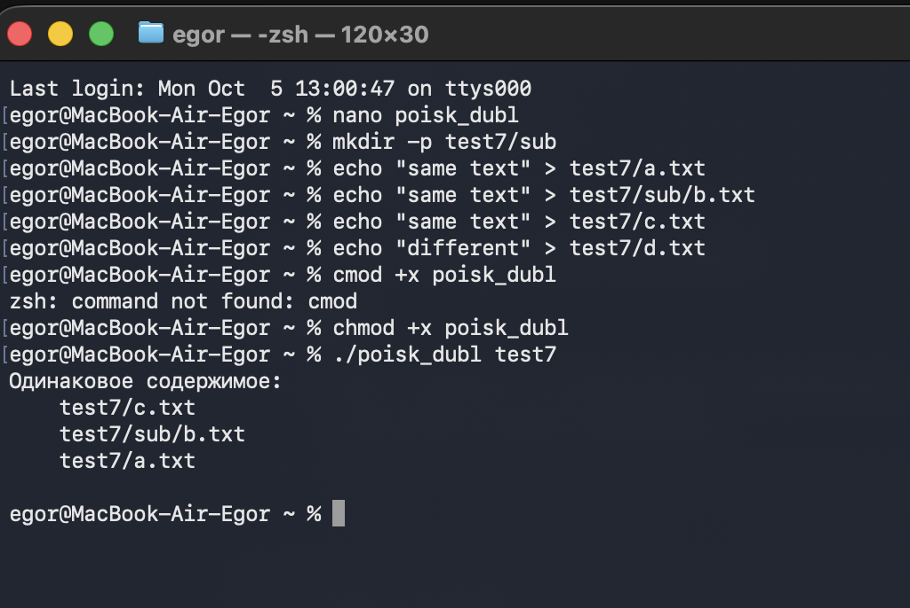

Найдена группа из `a.txt`, `c.txt` и `sub/b.txt` — поиск рекурсивный. `d.txt` отличается и не выведен.

## Задача 8

**Условие.** Написать программу, которая находит все файлы в данном каталоге с расширением, указанным в качестве аргумента, и архивирует их в архив tar.

**Решение.** `find` ищет по маске `*.$ext` (`-maxdepth 1` — только сам каталог) и отдаёт список через `-print0`; `tar --null -T -` читает его со стандартного ввода, что безопасно для имён с пробелами. Архив называется `files_<расширение>.tar`, `-v` показывает добавленные файлы.

Файл [src/archive](src/archive):

```bash
#!/bin/bash

if [ $# -lt 1 ]; then
    echo "Использование: $0 расширение [каталог]"
    exit 1
fi

ext="$1"
dir="${2:-.}"

find "$dir" -maxdepth 1 -type f -name "*.$ext" -print0 | tar -cvf "files_$ext.tar" --null -T -
```

**Запуск:** `./archive txt test8`

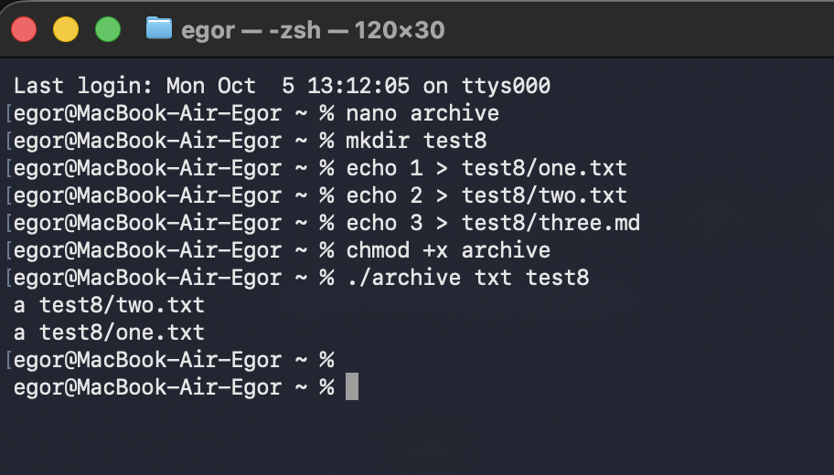

В архив попали `one.txt` и `two.txt`; `three.md` не архивировался.

## Задача 9

**Условие.** Написать программу, которая заменяет в файле последовательности из 4 пробелов на символ табуляции. Входной и выходной файлы задаются аргументами.

**Решение.** Подстановка `sed` с флагом `g` заменяет все вхождения. Табуляция получается через `printf '\t'` и подставляется переменной: `sed` в macOS не понимает `\t` в строке замены. Результат пишется в выходной файл, исходный не меняется. Проверка — `cat -t` (табуляция отображается как `^I`).

Файл [src/tab](src/tab):

```bash
#!/bin/bash

if [ $# -ne 2 ]; then
    echo "Использование: $0 входной_файл выходной_файл"
    exit 1
fi

tab=$(printf '\t')
sed "s/    /$tab/g" "$1" > "$2"
```

**Запуск:** `./tab in.txt out.txt`, затем `cat -t out.txt`.

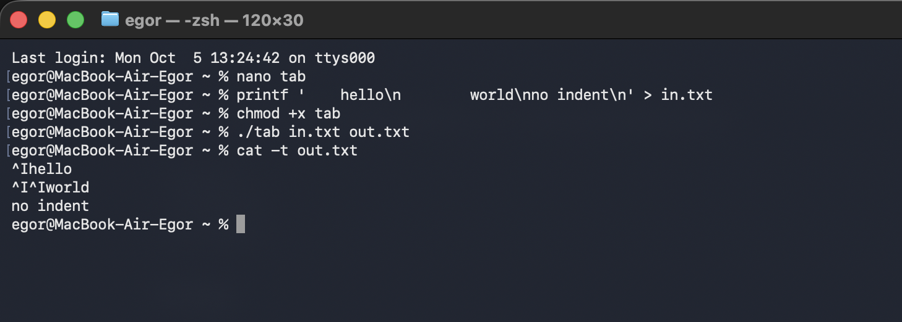

Строки с отступом 4 и 8 пробелов превратились в одну и две табуляции, строка без отступа не изменилась.

## Задача 10

**Условие.** Написать программу, которая выводит названия всех пустых текстовых файлов в указанной директории. Директория передаётся параметром.

**Решение.** У `find` есть предикат `-empty` — файл нулевого размера. `-type f` и `-name '*.txt'` оставляют только текстовые файлы. Поиск идёт и в подкаталогах.

Файл [src/pusto](src/pusto):

```bash
#!/bin/bash

if [ $# -ne 1 ]; then
    echo "Использование: $0 каталог"
    exit 1
fi

find "$1" -type f -name '*.txt' -empty
```

**Запуск:** `./pusto test10`

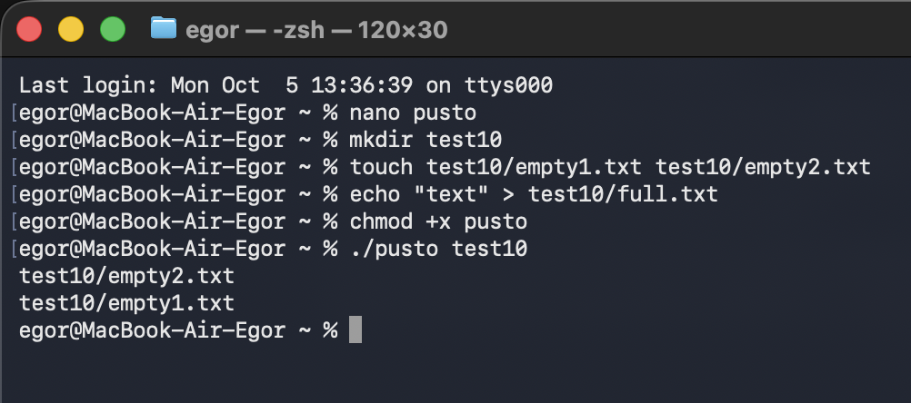

В вывод попали `empty1.txt` и `empty2.txt`; `full.txt` содержит текст.

